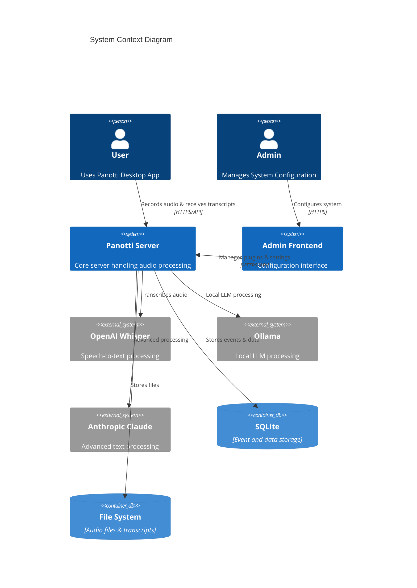
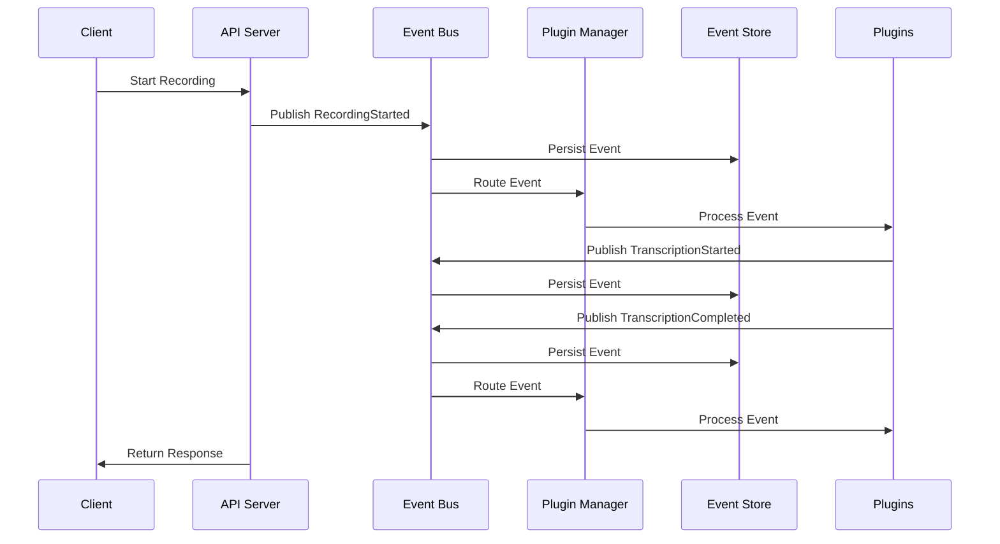

# Panotti Server Architecture

## Overview

Panotti Server is a modular, event-driven system designed for audio processing and meeting transcription. The architecture consists of two main components:
1. A FastAPI-based backend server with a plugin system
2. A Next.js-based admin frontend for configuration management

## System Context Diagram



## Component Architecture

```mermaid
C4Component
    title Component Diagram
    
    Container(api, "FastAPI Server", "Python", "Main application server")
    Container(admin, "Admin Frontend", "Next.js", "Configuration UI")
    
    Component(eventBus, "Event Bus", "Core", "Event distribution system")
    Component(pluginMgr, "Plugin Manager", "Core", "Plugin lifecycle management")
    Component(eventStore, "Event Store", "Core", "Event persistence")
    
    ComponentDb(sqlite, "SQLite", "Database", "Event and data storage")
    ComponentDb(fs, "File System", "Storage", "Audio & transcript files")
    
    Container_Boundary(plugins, "Plugins") {
        Component(transcription, "Audio Transcription", "Plugin", "Local speech-to-text")
        Component(cleanup, "File Cleanup", "Plugin", "Resource management")
        Component(notifier, "Desktop Notifier", "Plugin", "System notifications")
    }
    
    Rel(api, eventBus, "Publishes events")
    Rel(eventBus, pluginMgr, "Routes events")
    Rel(eventBus, eventStore, "Persists events")
    
    Rel(pluginMgr, plugins, "Manages")
    Rel(plugins, eventBus, "Subscribe/Publish")
    
    Rel(eventStore, sqlite, "Stores data")
    Rel(plugins, fs, "Read/Write files")
    
    Rel(admin, api, "Configures", "HTTPS/API")
```

## Event Flow Sequence



## Directory Structure

### Backend (FastAPI)
```
app/
├── core/                     # Core system interfaces and protocols
│   ├── events/              # Event system implementation
│   │   ├── bus.py          # EventBus implementation
│   │   ├── models.py       # Event models
│   │   └── persistence.py  # Event persistence
│   └── plugins/            # Plugin system core
│       ├── interface.py    # Plugin interfaces
│       └── manager.py      # Plugin management
├── models/                  # Domain models
│   ├── database.py         # Database functionality
│   └── recording/          # Recording-related models
├── plugins/                # Plugin implementations
│   ├── audio_transcription_local/
│   ├── cleanup_files/
│   └── desktop_notifier/
└── main.py                # Application entry point
```

### Admin Frontend (Next.js)
```
admin-frontend/
├── app/
│   ├── (auth)/            # Authentication routes
│   ├── (protected)/       # Protected routes
│   │   ├── admin/        # Admin settings
│   │   └── settings/     # Plugin settings
│   └── api/              # API routes
├── components/           # React components
├── lib/                 # Utilities
└── public/             # Static assets
```

## Core Components

### Event System
- **EventBus**: Asynchronous event distribution system
- **Event Models**: Type-safe event definitions
- **Event Persistence**: SQLite-based event storage
- **Event Priority Levels**: LOW, NORMAL, HIGH

### Plugin System
- **Plugin Manager**: Handles plugin lifecycle
- **Plugin Base**: Abstract base class for plugins
- **Configuration**: YAML-based plugin configuration
- **Hot Reload**: Dynamic plugin loading/unloading

### Admin Interface
- **Plugin Management**: Enable/disable plugins
- **Configuration**: Edit plugin settings
- **Environment Variables**: Manage system configuration
- **Authentication**: Secure admin access

## Security

### Authentication & Authorization
- API Key authentication for server endpoints
- Password protection for admin interface
- Role-based access control

### Data Protection
- Environment-based configuration
- Secure credential storage
- Access control and audit logging

### Error Handling
- Structured error logging
- Graceful degradation
- Plugin isolation
- Resource cleanup

## Dependencies

### Backend
- FastAPI: Web framework
- SQLite: Data storage
- PyYAML: Configuration parsing
- Pydantic: Data validation
- Anthropic: Claude API integration
- Whisper: Speech-to-text
- Ollama: Local LLM processing

### Frontend
- Next.js 14: React framework
- TailwindCSS: Styling
- React Query: Data fetching
- Zod: Schema validation

## Deployment

### Server Configuration
- ASGI server (uvicorn)
- Worker processes based on CPU cores
- Health check endpoints
- Resource limits

### Container Support
- Docker configuration
- Docker Compose for development
- Volume management
- Network setup

## Development Guidelines

### Code Style
- PEP 8 for Python
- ESLint/Prettier for TypeScript
- Type hints required
- Comprehensive documentation

### Testing
- Unit tests with pytest
- Integration tests
- Component testing
- End-to-end testing

### Error Handling
- Structured logging
- Graceful degradation
- Error context
- Recovery procedures

### Plugin Development
- Follow plugin interface
- Include configuration schema
- Document dependencies
- Handle lifecycle events
